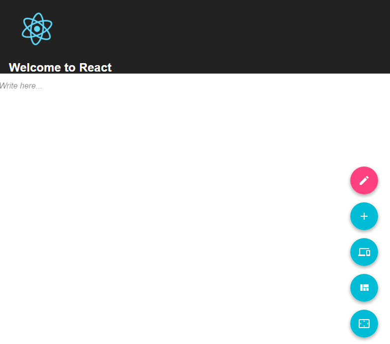

# Getting started

## Philosophy

The goal of react-page is to create a simple to use, simple to configure full page editor with react. In order to achieve these somewhat self contradicting goals, we offer a few different ways to use the editor in your project. The editor also comes with optional user interface (UI package). You can choose to use it or create your own. Let's explore a few different approaches to setting up your editor.

Before we skip ahead, make sure that [node.js](https://nodejs.org/en/) is installed on your system.

## Installation

To install the editor, use:

```
$ yarn add @react-page/react-page
$ npm i --save @react-page/react-page
```

## Simple example

To get off the ground as soon as possible, simply create a component like so:

```jsx
import React, { useState, useCallback } from "react";

// The editor core
import Editor from "@react-page/editor";
import "@react-page/core/lib/index.css"; // we also want to load the stylesheets
// Require editor ui stylesheet
import "@react-page/ui/lib/index.css";

// Load some exemplary plugins:
import slate from "@react-page/plugins-slate"; // The rich text area plugin
import "@react-page/plugins-slate/lib/index.css"; // Stylesheets for the rich text area plugin
import background from "@react-page/plugins-background"; // A plugin for background images
import "@react-page/plugins-background/lib/index.css"; // Stylesheets for  background layout plugin

// Define which plugins we want to use. We only have slate and background available, so load those.
const plugins = {
  content: [slate()], // Define plugins for content cells. To import multiple plugins, use [slate(), image, spacer, divider]
  layout: [background({ defaultPlugin: slate() })] // Define plugins for layout cells
};

const App = () => {
  const [editorValue, setEditorValue] = useState(initialState);
  return (
    <Editor plugins={plugins} value={editorValue} onChange={setEditorValue} />
  );
};

export default App;
```

That's it, congratulations! You should see something like this now:



## Readonly

Simply provide a `readOnly={true}` prop to your editor from previous example. We will lazy load (using code splitting) the unnecessary UI if you use this approach. This can greatly decrease the size of this lib. Make sure to use this option if you don't require the editing capabilities of the editor and care about your app size (which you should!)

## Advanced

The editor package from `import Editor from "@react-page/editor";` includes some pre-made UI. It can be great for quick start, but very often, you'll find yourself in a situation where you will need to modify this UI. If that's the case, follow this approach instead.

```jsx
import React, { useState } from "react";

// The editor core
import Editor, { Editable, Provider, createEmptyState } from "@react-page/core";
import "@react-page/core/lib/index.css"; // we also want to load the stylesheets
// Require editor ui stylesheet
import "@react-page/ui/lib/index.css";

// Load some exemplary plugins:
import slate from "@react-page/plugins-slate"; // The rich text area plugin
import "@react-page/plugins-slate/lib/index.css"; // Stylesheets for the rich text area plugin
import background from "@react-page/plugins-background"; // A plugin for background images
import "@react-page/plugins-background/lib/index.css"; // Stylesheets for  background layout plugin

// Define which plugins we want to use. We only have slate and background available, so load those.
const plugins = {
  content: [slate()], // Define plugins for content cells. To import multiple plugins, use [slate(), image, spacer, divider]
  layout: [background({ defaultPlugin: slate() })] // Define plugins for layout cells
};

const editables = [createEmptyState()];

const editor = new Editor({
  plugins,
  editables
});

const App = () => {
  const [editorValue, setEditorValue] = useState(editables[0]);
  return (
    <Provider editor={oryEditor} dndBackend={finalBackend}>
      {/*
      The provider exposes all of editor's internal context. 
      You can hook into this by connecting to it's redux state and altering and of it's state.
      Please look into https://github.com/react-page/react-page/tree/master/packages/ui/src 
      to learn about about how custom UI can be implemented.
      */}
      <Editable id={editorValue.id} onChange={setEditorValue} />
    </Provider>
  );
};

export default App;
```
